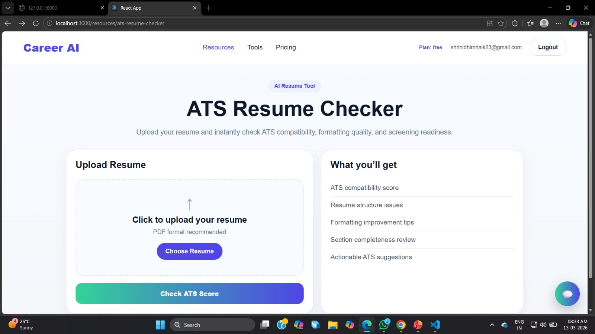
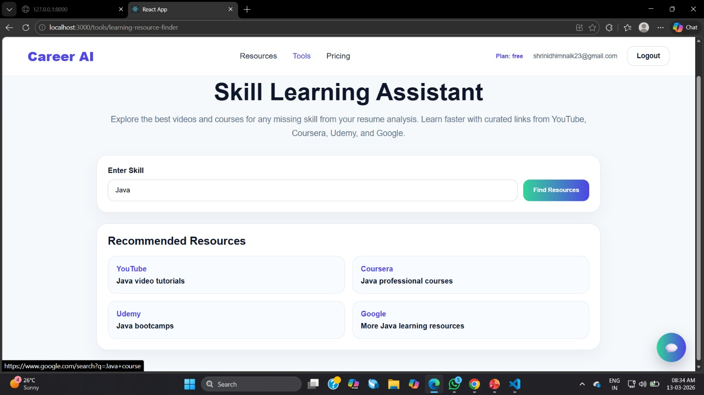
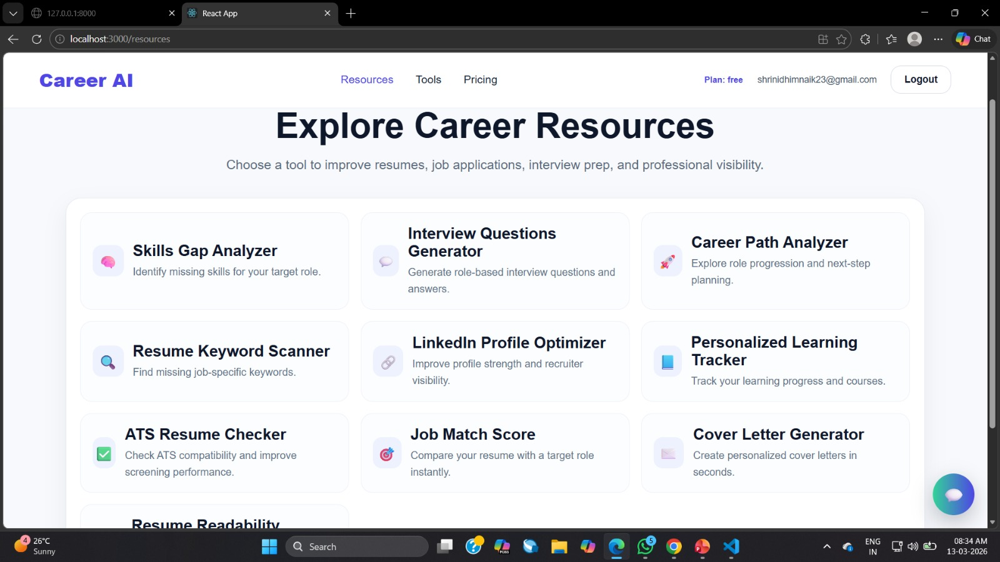

# Career-AI

AI-powered career intelligence platform that analyzes resumes, identifies skill gaps, improves ATS compatibility, and recommends learning resources to accelerate career growth.

---

## 🚀 Features
- Resume Analysis
- Skill Gap Detection
- ATS Score Improvement
- Learning Recommendations

---

## 📸 Screenshots

### 🏠 Home Page

### 📊 Dashboard

### 📤 Resume Upload

---

## 🛠 Tech Stack
- Frontend: React.js
- Backend: FastAPI
- AI: NLP (Resume Analysis)

